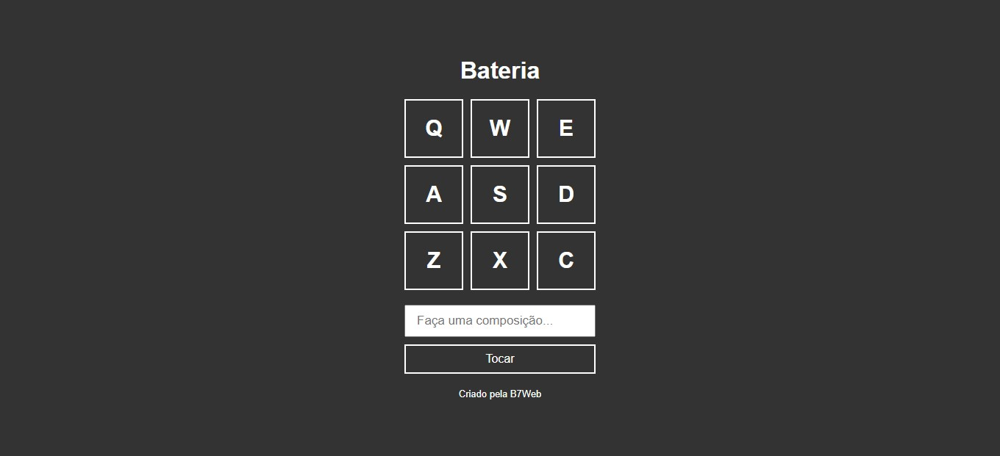

# 7 projetos Javascript para fazer em 7 dias!

Esta lista de projetos foi retirada da plataforma de cursos b7web e deixo abaixo o link de todas as aulas para você:

https://b7web.com.br/d7/?d=0

## 1 - Bateria

Cada tecla do teclado conforme as que são exibidas na tela representam um som de bateria diferente, podendo assim formar uma música, no campo de composição se digitar a sequência e clicar em tocar ele irá tocar as teclas conforme a ordem e caso queira dar um espaço de tempo é só usar a tecla de espaço.

## 2 - Relógio Analógico

O relógio analógico movimenta seus ponteiros de acordo com a hora atual.

## 3 - Clima

Digite o nome da cidade na qual queira saber as informações meteorológicas.

## 4 - Jogo da Velha

Jogo da velha onde é informado a vez de cada jogador e o vencedor.

## 5 - Quadro Canvas

Selecione a cor desejada e faça desenhos no quadro.

## 6 - Quiz Javascript

Ao final do quiz ele calcula sua pontuação.

## 7 - Arrastar e Soltar

Este projeto trabalha o movimento de elementos na tela, desde o arrastar, soltar e o clicar em cima dele, movimentos parecidos com os cards do trello.

